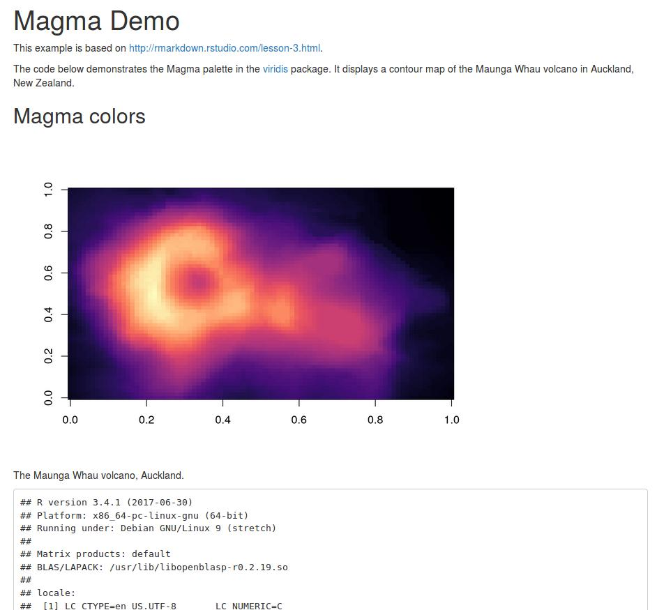

# Templates for reproducible research

30 Minutes

---------------------------------------------------

## Learning Objectives

- What are Dockerfiles?
- What are common commands in Dockerfiles?
- How can a Dockerfile be used to compile a literate programming document?

---------------------------------------------------

## Writing a Dockerfile

Docker can build images based on the instructions from a Dockerfile.
The instructions can be used for example to run arbitrary commands in the container and to copy files.
Images can extend on existing images.

Create a new text file named `Dockerfile` in a temporarly directory.

```bash
cd /tmp/authorcarpentry-docker/
touch Dockerfile
```

Open it with a text editor and paste the following content

```Dockerfile
FROM rocker/rstudio

WORKDIR /home/rstudio
COPY articles.csv articles.csv

RUN install2.r wordcloud tm
```

We use Rocker's RStudio as the base image and copy the file `articles.csv` into the container to the directory `/data`.

Now we must tell Docker to create an image.

```bash
docker build --tag authorcarpentry-docker-articles .
```

We use the tag `authorcarpentry-docker-articles` to be able to identify the image.

No start the image as usual and open the file in RStudio (go to http://localhost:8787 > File > Open File).

```bash
docker run -it -p 8787:8787 authorcarpentry-docker-articles
```

Now you can load and work with the data in R. Analysis example is based on [https://www.r-bloggers.com/building-wordclouds-in-r/](https://www.r-bloggers.com/building-wordclouds-in-r/).

```R
data <- read.csv("articles.csv")
head(data)

library(wordcloud); library(tm)

titles <- VCorpus(VectorSource(data$Title))
titles <- tm_map(titles, PlainTextDocument)
wordcloud(titles)
```

You can learn all about [Dockerfiles in the Docker docs](https://docs.docker.com/engine/reference/builder/).

_How is this useful for reproducible research?_

You can create images tailored to your use case in a transparent way.
If Docker every disappears, at least you will have all the instructions you originally used to create the image.

## Common Dockerfile elements

 **Command** | **Explanation** 
 ----- | -----
`FROM` | specifies which base image, or stack of base images, your image is built on
`MAINTAINER` | specifies who created and maintains the image.
`CMD` | specifies the command to run immediately when a container is started from this image, unless you specify a different command.
`COPY` | will copy new files from a source and add them to the containers filesystem path
`WORKDIR` | sets the current directory for `RUN` and `COPY` statements (preferred over using `RUN cd ..`)
`RUN` | does just that: It runs a command inside the container (eg. `apt-get`)
`EXPOSE` | tells Docker that the container will listen on the specified port when it starts and the host may bind these
`VOLUME` | will create a mount point with the specified name and tell Docker that the volume may be mounted by the host

[based on](https://benmarwick.github.io/UW-eScience-docker-for-reproducible-research/#14)

## Compiling a literate programming document

Of course you can do more than just run an R script.
You can also compile a literate programming document, such as a scientific publication.

Let's start with this example R Markdown document:

````
---
title: "Magma Demo"
output: html_document
---

This example is based on http://rmarkdown.rstudio.com/lesson-3.html.

```{r include = FALSE}
knitr::opts_chunk$set(echo = FALSE)
```

```{r message = FALSE, warning = FALSE}
library(viridis)
```

The code below demonstrates the Magma palette in the [viridis](https://github.com/sjmgarnier/viridis) package.
It displays a contour map of the Maunga Whau volcano in Auckland, New Zealand.

## Magma colors

```{r fig.cap = "The Maunga Whau volcano, Auckland."}
image(volcano, col = viridis(200, option = "A"))
```

```{r session}
sessionInfo()
```
````

Put this into a file `paper.Rmd` in a new directory on your computer.

The following `Dockerfile` starts from a version-fixed Rocker image, installs the required packages, and sets the rendering of the file as the image's default command.
It also uses [Label Schema](http://label-schema.org/) labels to embed the required documentation into the image.
Put the content of the snippet below into a file `Dockerfile` next to `paper.Rmd`.

```
FROM rocker/r-ver:3.4.1

RUN apt-get update -qq \
	&& apt-get install -y --no-install-recommends \
	## Packages required by R extension packages
	# required by rmarkdown:
	lmodern \
	pandoc \
	&& apt-get clean \
	&& rm -rf /var/lib/apt/lists/*

# install R extension packages
RUN install2.r -r "http://cran.rstudio.com" \
	  rmarkdown \
	  viridis \
	  && rm -rf /tmp/downloaded_packages/ /tmp/*.rd

# add metadata
LABEL maintainer="Me! <mail@me.edu>" \
    org.label-schema.usage="Run the image, then extract the created document with 'docker cp my-paper-container:/analysis/paper.html paper-from-container.html'" \
    org.label-schema.docker.cmd="docker run -it --name my-paper-container imagename" \
    org.label-schema.name="Docker for RR Demo" \
    org.label-schema.schema-version="1.0"

WORKDIR /analysis
COPY paper.Rmd paper.Rmd

ENTRYPOINT ["sh", "-c"]
CMD ["R --vanilla -e \"rmarkdown::render(input = '/analysis/paper.Rmd', output_format = rmarkdown::html_document())\""]
```

Build the Dockerfile with `docker build --tag my-paper .`

Run the image with `docker run -it --name my-paper-container my-paper` and inspect the output on the console.
We name the container so that we can more easily retrieve files from it.

Extract the created output file with [`docker cp`](https://docs.docker.com/engine/reference/commandline/cp/).

```bash
docker cp my-paper-container:/analysis/paper.html paper-from-container.html
```

You will see the following file:


 
Open the source code of the HTML document (`Ctrl + U` in most browses) and inspect it.
Noteworthy is the "embedding" of the image data in `base64`:

```
